class: inverse, left, nonum, clear

background-image: url("figures/ArcGISBook_Header.jpg")
background-size: cover

.titlestyle1[Analiza geo-prostornih podataka u R-u] 
<br><br><br>


<link rel="stylesheet" type="text/css" href="//fonts.googleapis.com/css?family=Lora" />

<br><br><br><br>

.titlestyle[Milutin Pejović & Petar Bursać]

.titlestyle[2022-12-14, Startit, Beograd]

---
# O nama

.pull-left[

```{r, purl=FALSE,echo=FALSE, out.width="50%", fig.align='center'}

```

.center[**doc. dr Milutin Pejović, dipl.geod.inž.**]

]


.pull-right[

```{r, purl=FALSE,echo=FALSE, out.width="50%", fig.align='center'}

```

.center[**Petar Bursac, dipl.geod.inž.**]

]

----

.center[**Građevinski fakultet Univerziteta u Beogradu**]
.center[**Odsek za Geodeziju i Geoinformatiku**]


---
# O nama

- 2004 - Master akademske studije Geoinformatike.

- 2008 - Laboratorija za razvoj geoporostornih tehnologija otvorenog koda [OSGL](http://osgl.grf.bg.ac.rs/en/)

- Kursevi i konferencije:

  - 2007 - GEOSTAT Belgrade workshop  - lectures: Tomislav Hengl
  
  - 2011 - GEOSTAT 2011 workshop - lectures: Victor Olaya, Tomislav Hengl
  
  - 2014 - World Daily Meteo Conference - keynote speakers: Edzer Pebesma, Gerard Heuvelink, Tomislav Hengl
  
  - 2016 - GeoMLA (Geostatistics and Machine Learning) conference; keynote speakers: Mikhail Kanevski, Mirko Orlić, Wolfgang Wagner, Ole Einar Tveito, Tomislav Hengl. 

- 2022 - <font color='red'>Geoinformatika</font> - novi studijski program na Građevinskom fakultetu 

---
class: inverse, center, middle,
# Šta su to geo-prostorni podaci?

---
# Šta su to geo-prostorni podaci?

.pull-left[

.tiny[

- **Kombinuju informaciju sa <font color='red'>geografskom lokacijom i vremenom </font> geografskom lokacijom i vremenom na koje se odnose**

- **Geo-prostorni vs. prostorni podaci**

- **Digitalno predstavljaju prirodne i antropogene objekte, prostorne pojave i dogadjaje stavljajući ih u kontekst geografskog prostora**

- **GPS je operativan od 2000 godine.**

- **In 2008, more than 150 Earth observation satellites were in orbit, recording data with both passive and active sensors and acquiring more than 10 terabits of data daily. (Fifty Years of Earth-observation Satellites by A. Tatem, S. Goetz, S. Hay)**

- **Danas je preko 80% digitalnih podataka referisano na geografsku lokaciju (bez reference)**
]

]

.pull-right[


```{r, echo=FALSE, out.width='100%', fig.align='center'}


```

```{r, echo=FALSE, out.width='80%', fig.align='center'}
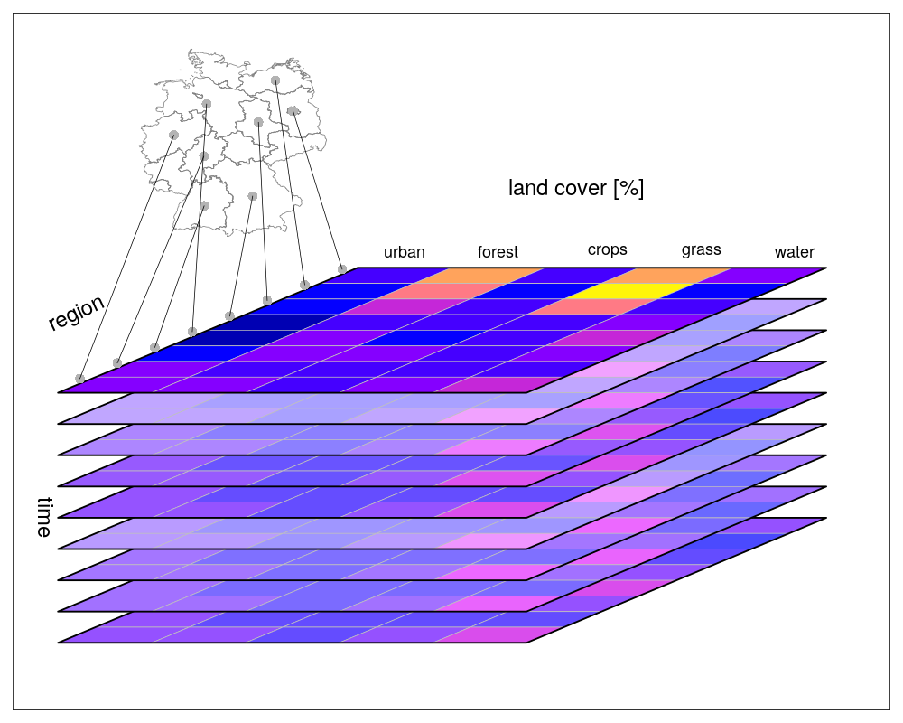

```

]


---
# Izvori geo-prostornih podataka

.pull-left[

.tiny[

- Javni podaci državnih službi (prostorni inventari, premer, popis i mape)
- Podaci permanentnih stanica i senzora (senzori)
- Podaci daljinske detekcije (GNSS, LiDAR i satelitski snimci)
- Personalni podaci i podaci sa društvenih mreža

- Javno dostupni podaci:
  - http://freegisdata.rtwilson.com/
  - https://data.nasa.gov/
  - https://land.copernicus.eu/
  - https://maps.elie.ucl.ac.be/CCI/viewer/
  - https://www.ecad    .eu//dailydata/predefinedseries.php
  - http://www.worldclim.org/version2
  - https://www.geoportal.org/
  - ...


]

]

.pull-right[


```{r, echo=FALSE, out.width='60%', fig.align='center'}
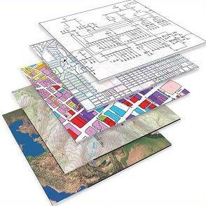

```

```{r, echo=FALSE, out.width='80%', fig.align='center'}
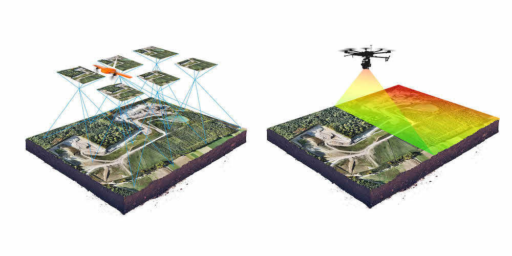

```

]

---
# Primeri primene geo-prostornih podataka

.pull-left[

.tiny[

- **<font color='red'>Ekologija</font>**
- **<font color='red'>Daljinska detekcija (satelitski snimci)</font>**
- **Ekonomija**
- **Demografija**
- **Arheologija**
- **Transport**
- **<font color='red'>Klimatologija</font>**
- **Meteorologija** 
- **<font color='red'>Geo-morfometrija</font>**
- **Hidrologija**
- **Urbano planiranje**
- **Rudarstvo**
- **<font color='red'>Zemljište</font>**
- **Turizam**
- **i mnogi drugi...**

]

]

.pull-right[

```{r, out.width="95%", echo=FALSE}
knitr::include_graphics("figures/montbayabove.gif")
```
 
```{r, echo=FALSE, out.width="95%"}
knitr::include_graphics("figures/water-detection.png")
```

]


---
class: inverse, center, middle,
# Geo-prostorni podaci u R-u


---
# Istorija


.large[
- **pre-2003. - razvoj drugih paketa namenjenih prostornoj analizi (<font color='red'>`MASS`</font>, <font color='red'>`spatstat`</font>, <font color='red'>`geoR`</font> itd.)**

- **2003. - Vienna workshop, početak rada na <font color='red'>`sp`</font> paketu i definisanju klasa i metoda namenjenih geo-prostornim podacima**

- **2003. - Publikovan paket <font color='red'>`rgdal`</font>**

- **2005. - Publikovan paket <font color='red'>`sp`</font>**

- **2005. - Applied Spatial Data Analysis with R, 1st ed.**

- **2010. - Publikovan paket <font color='red'>`raster`</font>**

- **2011. - Publikovan paket <font color='red'>`rgeos`</font>**

- **2013. - Applied Spatial Data Analysis with R, 2nd ed.**

- **2016. - Publikovan paket <font color='red'>`sf`</font>**

- **2019. - Publikovan paket <font color='red'>`stars`</font>**

- **2020. - Publikovan paket <font color='red'>`terra`</font>**
]


---
# Danas je to ceo univerzum

**Preko 1000 paketa namenjenih geoprostornim podacima**

- [**sf**](https://github.com/r-spatial/sf),
[**sp**](https://github.com/edzer/sp),
[**terra**](https://github.com/rspatial/terra),
[**raster**](https://github.com/rspatial/raster), [**stars**](https://github.com/r-spatial/stars), [**gdalcubes**](https://github.com/appelmar/gdalcubes_R) - klase i metode za skladištenje geo-prostornih podataka
 
- [**rnaturalearth**](https://github.com/ropensci/rnaturalearth), [**osmdata**](https://github.com/ropensci/osmdata), [**getlandsat**](https://github.com/ropensci/getlandsat) - download geo-prostornih podataka

- [**rgrass7**](https://github.com/rsbivand/rgrass7), [**qgisprocess**](https://github.com/paleolimbot/qgisprocess), [**RSAGA**](https://github.com/r-spatial/RSAGA), [**link2GI**](https://github.com/r-spatial/link2GI) - veza sa GIS softverima

- [**gstat**](https://github.com/r-spatial/gstat), [**mlr3**](https://github.com/mlr-org/mlr3), [**CAST**](https://github.com/HannaMeyer/CAST), [**spatstat**](http://spatstat.org/), [**spdep**](https://github.com/r-spatial/spdep), [**spatialreg**](https://github.com/r-spatial/spatialreg) - modeliranje geo-prosotrnih podataka

- [**rasterVis**](https://github.com/oscarperpinan/rastervis), [**tmap**](https://github.com/mtennekes/tmap), [**ggplot2**](https://github.com/tidyverse/ggplot2), [**rayshader**](https://github.com/tylermorganwall/rayshader) - statična vizualizacija i kartiranje
- [**leaflet**](https://github.com/rstudio/leaflet), [**mapview**](https://github.com/r-spatial/mapview), [**mapdeck**](https://github.com/SymbolixAU/mapdeck) - interaktivna vizualizacija i kartiranje

- many more...

CRAN task view: https://cran.r-project.org/web/views/Spatial.html.


---
# Osobine geo-prostornih podataka

.pull-left[


.tiny[

</br>
</br>

- **Koordinate i koordinatni sistem**

</br>
</br>
</br>
  
- **Geometrija**

</br>
</br>

- **Atributi i razmera**

]

]

.pull-right[


```{r, echo=FALSE, out.width='65%', fig.align='left'}
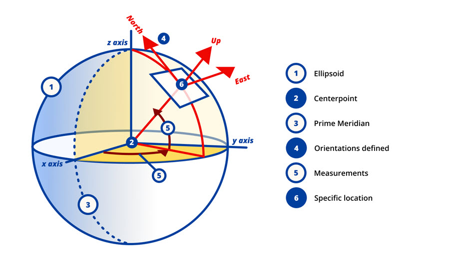

```


```{r, echo=FALSE, out.width='80%', fig.align='left'}
knitr::include_graphics('figures/2019-points-lines-polygons.png')

```


```{r, echo=FALSE, out.width='80%', fig.align='left'}
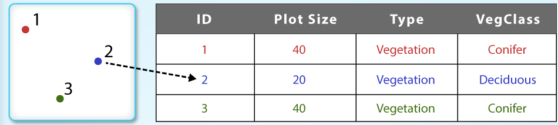

```

]


---
# Osobine geo-prostornih podataka

.pull-left[


.tiny[

</br>
</br>

- **<font color='red'>Koordinate i koordinatni sistem</font>**

</br>
</br>
</br>
  
- **Geometrija**

</br>
</br>

- **Atributi i razmera**

]

]

.pull-right[


```{r, echo=FALSE, out.width='65%', fig.align='left'}


```


```{r, echo=FALSE, out.width='80%', fig.align='left'}
knitr::include_graphics('figures/2019-points-lines-polygons.png')

```


```{r, echo=FALSE, out.width='80%', fig.align='left'}


```

]


---
# Koordinate i Koordinatni Referenti Sistem (CRS)


.center[
***<font color='red'>"Data are not just numbers, they are numbers with a context; “In data analysis, context provides meaning”</font>*** ([Cobb and Moore, 1997](http://www.jstor.org/stable/2975286))
]

--

.center[
***<font color='darkgreen'>"Coordinates are not just numbers, they are numbers with a spatial context”</font>***
]

----

--

**<font color='red'>Koordinatni Referentni Sistem (CRS)</font> definiše prostorni kontekst. On predstavlja set informacija kojim se opisuje geografski prostoru u matematičkom smislu (u odnosu na Zemlju) i sastoji se od:**

- set matematičkih pravila kojim se definiše kako se koordinate dodeljuju tačkama u prostoru (koordinatni sistem)
- set parametara koji definišu poziciju početka koordiatnog sistema, razmera i orijentacija koordinatnog sistema (datum)

----

--

**Možemo razlikovati dve glavne grupe koordinatnih referentih sistema: <font color='red'>Geografski koordinatni sistemi</font> i <font color='red'>Koordinatni sistemi u projekciji</font>**


---
# Geografski (geodetski) koordinatni sistem


.pull-left[

- **Podrzumevaju definisane: elipsoid, početni meridian (podrazumevan), datum**

</br>


- **Određuju poziciju u okviru elipsoidnog koordinatnog referentnog sistema**

  - **Geografska širina i dužina (Latitude, longitude) i elispoidna visina**
  
  - **Geocentrični metrički sistem (X, Y, Z)**
  
]


.pull-right[

```{r echo=FALSE, massage=FALSE}

suppressPackageStartupMessages(suppressWarnings(library(sf)))
suppressPackageStartupMessages(suppressWarnings(library(here)))
suppressPackageStartupMessages(suppressWarnings(library(tmap)))
suppressPackageStartupMessages(suppressWarnings(library(tidyverse)))

GK <- "+proj=tmerc +lat_0=0 +lon_0=21 +k=0.9999 +x_0=7500000 +y_0=0 +ellps=bessel +towgs84=574.027,170.175,401.545,4.88786,-0.66524,-13.24673,0.99999311 +units=m"

srbija <- suppressMessages(st_read(here::here("data", "Srbija", "RAP.shp"), quiet = TRUE))

srbija_wgs <- st_transform(srbija, 4326)

srbija_gk <- st_transform(srbija, GK)

ggplot(srbija) + geom_sf() + theme_bw()

```

]
---
# Koordinatni sistemi u projekciji

.pull-left[

- **Podrzumevaju definisane: elipsoid, početni meridian (podrazumevan), datum i parametre projekcije**

</br>

- **Pozicija se određuje pravouglim koordinatama (Easting, Northing)**

]

.pull-right[

```{r echo=FALSE}

ggplot(srbija_gk) + geom_sf() + coord_sf(datum = st_crs(GK)) + theme_bw()

```

]

---
# Opis koordinatnog sistema


.pull-left[
**Dva prustupa su najzastupljenija:**

- CRS codes, e.g., EPSG:4326
- `WKT2`

**Do sada najzastupljeniji, ali u svom zalasku:**

- `proj4string` - `r st_crs(4326)$proj4string`

----

*Više informacija:*

.tiny[
- https://proj.org/usage/projections.html
- https://spatialreference.org/ref/epsg/
- https://www.youtube.com/watch?v=Va0STgco7-4 
- https://www.gaia-gis.it/fossil/libspatialite/wiki?name=PROJ.6

]

]

.pull-right[
.tiny[
```{r, purl=FALSE,echo=FALSE}
st_crs(4326)
```
]
]


---
class: inverse, center, middle,
# Vektorski model podataka


---
# Vektorski model podataka

.pull-left[

## <font color='red'>Vektorski podaci</font>

.tiny[

- **Tačke, linije, poligoni (kombinacije osnovnih geometrijskih entiteta)**

- **Predstavljaju diskretne objekte u prostoru**

  - **Uzorkovanja (merenja) na određenim lokacijama**
  
  - **Granice područja**
  
  - **Trase i trajektorije**
  
- **Poznati fajl formati: ESRI Shapefile (.shp, .shx, .dbf, .prj), GeoJSON, GPX (.gpx), geopackage (.gpk)**


]

]

.pull-right[


```{r, echo=FALSE, out.width='35%', fig.align='center'}
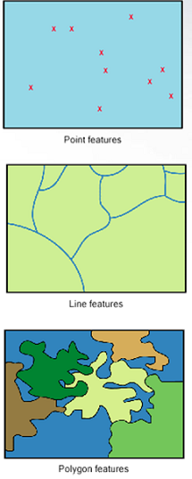

```
`

]

---
class: hide-logo
# <font color='red'>sf</font> paket (revolucija u radu sa geo-prostornim podacima)

```{r echo = FALSE, out.width = '20%', fig.align='center'}
knitr::include_graphics("figures/sf_logo.gif")
```

- **<font color='red'>sf</font> je naslednik (2016) <font color='red'>sp</font> paketa koji omogućava klase i metode za vektorske geo-prostorne podatke.**

-	**<font color='red'>sf</font> implmenetira OGC standard `ISO 19125-1:2004` <font color='red'>Simple Features</font>  za reprezentovanje geo-prostornih podataka**

- **<font color='red'>sf</font> omogućava funkcionalnosti dobro poznatih i proverenih biblioteka: `GDAL`, `PROJ` and `GEOS`.**

-	**<font color='red'>sf</font> classes are stored within `data.frame` like objects.**

- **Komplementaran je sa <font color='red'>tidyverse</font> familijom paketa!**

???
Simple feature is an international standard for representing and encoding spatial data, dominantly represented by point, line, and polygon geometries (ISO, 2004). The most important reason for using this approach is better manipulation of spatial data geometry, and simple way to store geometries in data corresponding record, or data.frame "row", which works very well with the tidyverse package family.

---
# sf ekosistem


```{r, echo=FALSE, out.width="60%", fig.align='center'}
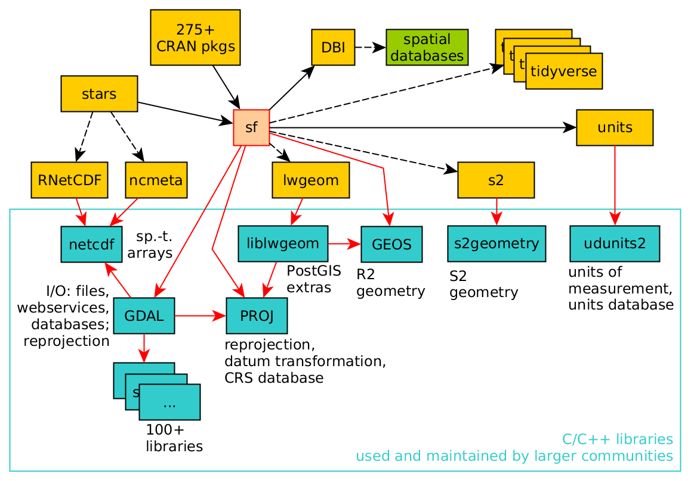
```


---
# sf klasa inside

```{r, echo=FALSE, out.width="80%", fig.align='center'}
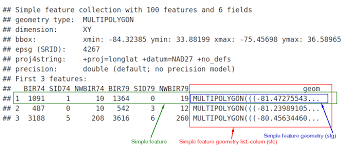
```


---
# OSGeo biblioteke

.pull-left[
**[PROJ](https://www.osgeo.org/projects/proj/)**

- "Konverzija koordinata"
- Prva verzija [1970s](https://en.wikipedia.org/wiki/PROJ#cite_note-Kresse_Danko_2011_p._948-3)

**[GDAL](https://www.osgeo.org/projects/gdal/)**

- Geospatial Data Abstraction Library, prva verzija 2000
- "200+ geo-prostornih fajl formata"

**[GEOS](https://www.osgeo.org/projects/gdal/)**

- Geometry Engine – Open Source

]
.pull-right[
<a href="https://www.osgeo.org/">
```{r, echo=FALSE, out.width="50%"}
knitr::include_graphics("https://www.osgeo.org/wp-content/themes/roots/assets/img/logo-osgeo.svg")
```

- **sf** omogućava pristup ovim bibliotekama 🎉

]

---
class: inverse, center, middle,
# Rasterski model podataka

---
# Rasterski model podataka

.pull-left[

## <font color='red'>Rasterski podaci</font>

.tiny[

- **Rasterski podaci predstavljaju mozaik manjih poligona (ćelija), najčešće kvadratnih i jednakih dimenzija, u kojem svaka čelija predstavlja vrednost prostornog fenomena u odgovarajućoj prostornoj oblasti na koju se čelija odnosi, u određenom trenutku**

- **Prirodni format satelitskih i aero-snimaka zemlje iz vazduha**

- **Odgovarajuči za predstavljanje kontinualnih objekata u prostoru (temperatura, nadmosrska visina, itd)**

- **Poznati fajl formati: GeoTIFF, Erdas Imagine Image (.img), HDF (.hdf), NetCDF (.nc)**


]

]

.pull-right[


```{r, echo=FALSE, out.width='35%', fig.align='center'}
knitr::include_graphics('figures/raster_1.png')

```
`

]


---
# <font color='red'>terra</font> paket


**terra** je naslednik (unapredjena verzija) **raster** paketa


.pull-left[
- The **terra** package contains classes and methods representing raster objects

- Omogućava učitavanje "single and multiband" rasterskih podataka

- Rasterska algebra i procesiranje rasterskih podataka

- Dodatne funkcionalnosti za analizu terena

- Omogućava rad sa velikim setom podataka

- ?`terra-package`, https://rspatial.github.io/terra/reference/terra-package.html
]

.pull-right[

```{r, echo=FALSE, out.width="80%", fig.align='center'}
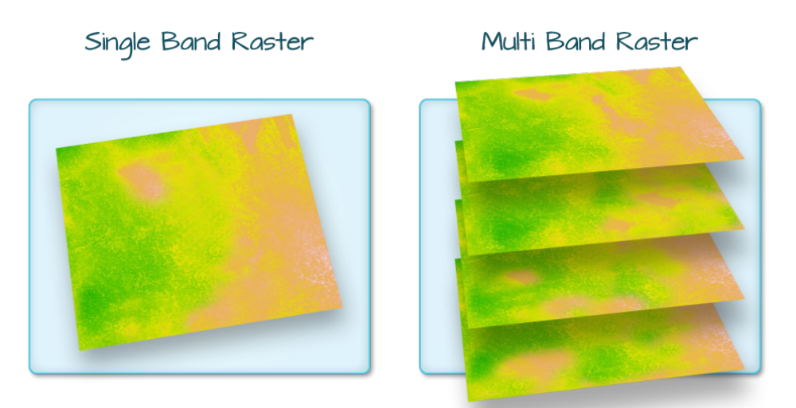
```
]

---
# terra klase: <font color='red'>SpatRaster</font>

</br>

**`SpatRaster`** je multi-lejer objekat koji je namenjen radu sa velikim rasterskim podacima koji ne mogu biti skaldišteni u radnom memoriji računara.  On skladišti niz osnovnih parametara koji ga opisuju. To uključuje broj kolona i redova, koordinate njegovog prostornog obuhvata (eng. extent) i koordinatni referentni sistem (projekcija). Pored toga, SpatRaster može da skladišti informacije o fajlovima u kojima se čuvaju vrednosti rasterskih ćelija. 


---
class: inverse, center, middle,
# Data Cubes - Višedimenzionalne strukture geo-prostornih podataka


---
# Data Cubes

.pull-left[

.tiny[

- **Uključivanje vremenske komponente u prostorne podatke**

  - **tro-dimenzionalni podaci (vektor)**
  
  - **četvoro-dimenzionalni podaci (raster)**
  
  - **više-dimenzionlani podaci**

- **Odgovarajuči za predstavljanje podataka prostornog monitoringa**

]

]

.pull-right[


```{r, echo=FALSE, out.width='45%', fig.align='center'}


```


```{r, echo=FALSE, out.width='70%', fig.align='center'}
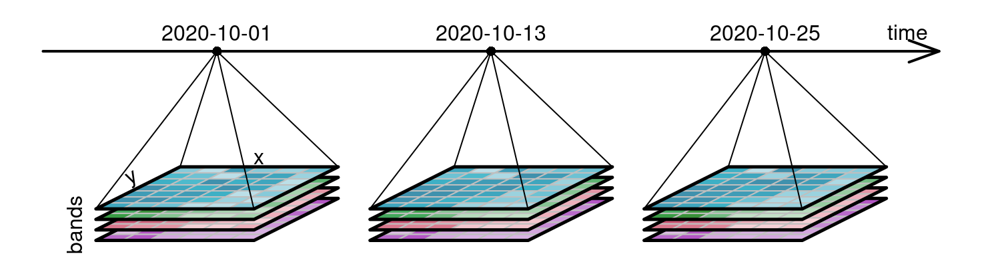

```


```{r, echo=FALSE, out.width='45%', fig.align='center'}
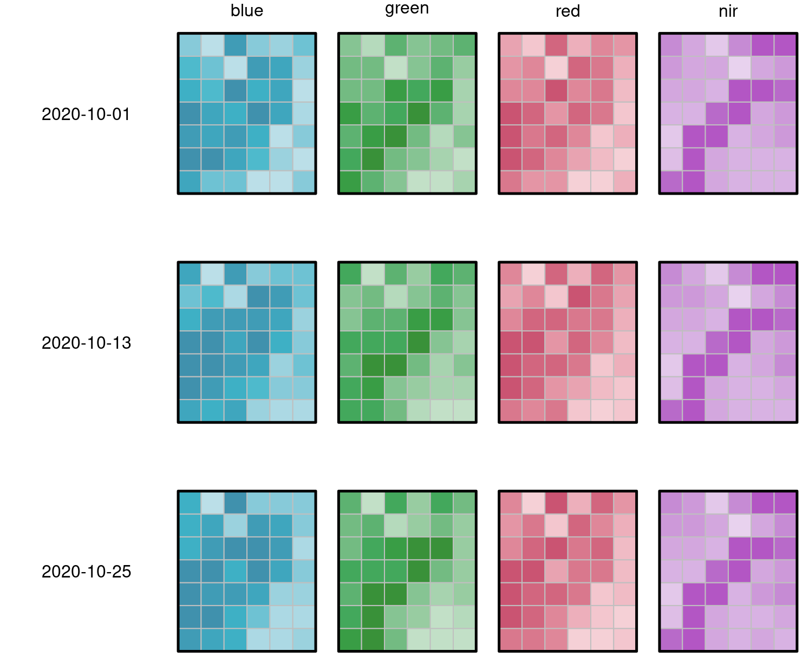

```

]

---
# <font color='red'>stars</font> paket


.pull-left[

- The **stars** package contains classes and methods representing spatiotemporal data (raster and vector data cubes)

- It allows raster data to be loaded and saved

- It allows raster processing

- It allows you to work on large sets of data

- It supports regular, rotated, sheared, rectilinear and curvilinear rasters

- https://r-spatial.github.io/stars/
]

.pull-right[
```{r, echo=FALSE, out.width="80%", fig.align='center'}
knitr::include_graphics("figures/cube2.png")
```
]

---
# <font color='red'>gdalcubes</font> paket

## Harmonizacija podataka satelitskih snimaka

.pull-left[

- Images from different areas of the world have different spatial reference systems (e.g., UTM zones).
- The pixel size of a single image sometimes differs among its spectral bands / variables.
- Spatially adjacent image tiles often overlap.
- Time series of images are often irregular when the area of interest covers spatial areas larger than the extent of a single image.
- Images from different data products or different satellites are distributed in diverse data formats and structures.

]


---
# <font color='red'>sftime</font> paket

- **`sftime` - predstavlja proširenje `sf` klasa za skladištenje i manipulaciju prostorno-vremenskim vektorskim podacima**

- **Prvi put publikovan u martu 2022. godine**

- **Kreiran je sa ciljem na nadomesti nedostatke `stars` paketa u pogledu geometrije i regularnosti vremenske serije podataka**


---
class: inverse, center, middle,
# Analiza geo-prostornih podataka u R-u


---
class: inverse, center, middle

*"Spatial data science treats location, distance, and spatial interaction as core aspects of the data and employs specialized methods and software to store, retrieve, explore, analyze, visualize and learn from such data. In this sense, spatial data science relates to data science as spatial statistics to statistics, spatial databases to databases, and geocomputation to computation."*

.right[Luc Anselin, 2019]
.right["Spatial Data Science" in The International Encyclopedia of Geography: People, the Earth, Environment, and Technology.]

---
# Životni vek podataka 


```{r, echo=FALSE, out.width='80%', fig.align='center'}
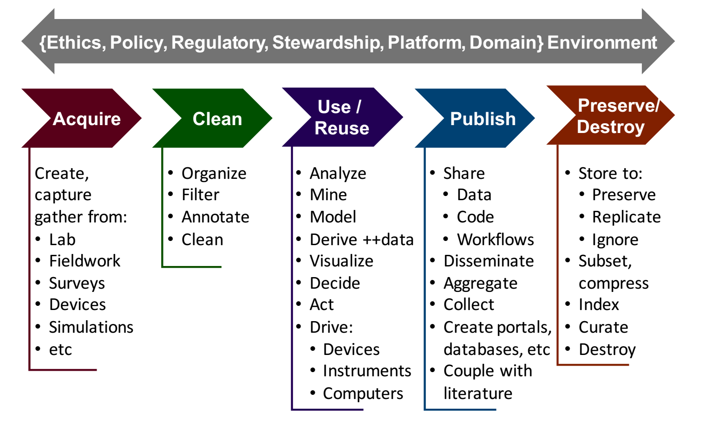

```

---
# Šta obuhvata analiza geo-prostornih podataka?

1. **Učitavanje i ispisivanje geo-prostornih podataka**
2. **Skladištenje i manipulacija podacima (klase i metode)**
3. **Deskriptivna i ekspanatorna analiza podataka**
4. **Konverzija i transformacija koordinata**
4. **GIS analiza i kartiranje**
5. **Statistična i geostatistička analiza**
6. **Modeliranje i prostorna predikcija**
7. **Komunikacija i publikacija**


???
Notes about the second idea. 


---
# Kako izgleda R ekosistem za geoprostorne podatke

- Kontinuirano se razvija od 2000 godine


```{r, echo=FALSE, out.width="50%", fig.align='center'}
knitr::include_graphics("figures/fig-sfgeometries-1.png")
```


```{r setup2, include=FALSE, purl=FALSE}
options(htmltools.dir.version = FALSE)
knitr::opts_chunk$set(fig.align = "center", cache = FALSE, fig.height = 5, echo = TRUE)
knitr::opts_chunk$set(root.dir = normalizePath("."))
```

```{r, purl=FALSE,echo=FALSE, message=FALSE}
library(sf)
## sfc objects creation ---------
point_sfc = st_sfc(st_point(c(1, 1)), crs = 4326)
linestring_sfc = st_sfc(st_linestring(rbind(c(0.8, 1), c(0.8, 1.2), c(1, 1.2))), crs = 4326)
polygon_sfc = st_sfc(st_polygon(list(rbind(
  c(1.2, 0.6), c(1.4, 0.6), c(1.4, 0.8), c(1.2, 0.8), c(1.2, 0.6)
))), crs = 4326)
multipoint_sfc = st_sfc(st_multipoint(rbind(c(1, 0.6), c(1.4, 1.1))), crs = 4326)
multipoint_sfc2 = multipoint_sfc - 0.5
multilinestring_sfc = st_sfc(st_multilinestring(list(rbind(
  c(1.2, 1), c(1.2, 1.4)
),
rbind(
  c(1.4, 0.4), c(1.6, 0.6), c(1.6, 0.8)
))), crs = 4326)
multipolygon_sfc = st_sfc(st_multipolygon(list(list(rbind(
  c(1.4, 1.2), c(1.6, 1.4), c(1.4, 1.4), c(1.4, 1.2)
)),
st_polygon(
  list(rbind(
    c(0.6, 0.6), c(0.9, 0.6), c(0.9, 0.9), c(0.6, 0.9), c(0.6, 0.6)
  ),
  rbind(
    c(0.7, 0.7), c(0.8, 0.8), c(0.8, 0.7), c(0.7, 0.7)
  ))
))),
crs = 4326)
## sf objects creation ---------
point_sf = st_sf(geometry = point_sfc)
linestring_sf = st_sf(geometry = linestring_sfc)
polygon_sf = st_sf(geometry = polygon_sfc)
multipoint_sf = st_sf(geometry = c(multipoint_sfc, multipoint_sfc2))
multilinestring_sf = st_sf(geometry = multilinestring_sfc)
multipolygon_sf = st_sf(geometry = multipolygon_sfc)
geometrycollection_sf = st_cast(
  c(
    point_sfc,
    linestring_sfc,
    polygon_sfc,
    multipoint_sfc,
    multilinestring_sfc,
    multipolygon_sfc
  ),
  "GEOMETRYCOLLECTION"
)
```


---
class: inverse, center, middle,
# Zašto je R fantastično okruženje za rad sa prostornim podacima?

---
# Zašto R za analizu geo-prostornih podataka?

- Moguća je kompletna analiza
- Lako podeliti kartu sa drugima (email, html...)

---
class: inverse, center, middle, 

# <font color='red'>terra paket</font>


---
# Klase rasterskih podataka u <font color='red'>terra</font> paketu

**`terra`** paket omogućava metode za manipulaciju i rad sa prostornim podacima u rasterskom i vektorskom formatu. Osnovne klase u `terra` paketu su sledeće

* **`SpatRaster`**

* **`SpatVector`**

* **`SpatExtent`**

---
# <font color='red'>SpatRaster</font>

</br>

**`SpatRaster`** je multi-lejer objekat koji je namenjen radu sa velikim rasterskim podacima koji ne mogu biti skaldišteni u radnom memoriji računara.  On skladišti niz osnovnih parametara koji ga opisuju. To uključuje broj kolona i redova, koordinate njegovog prostornog obuhvata (eng. extent) i koordinatni referentni sistem (projekcija). Pored toga, SpatRaster može da skladišti informacije o fajlovima u kojima se čuvaju vrednosti rasterskih ćelija. 


