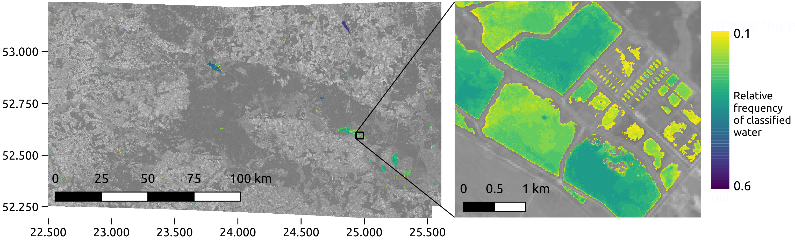
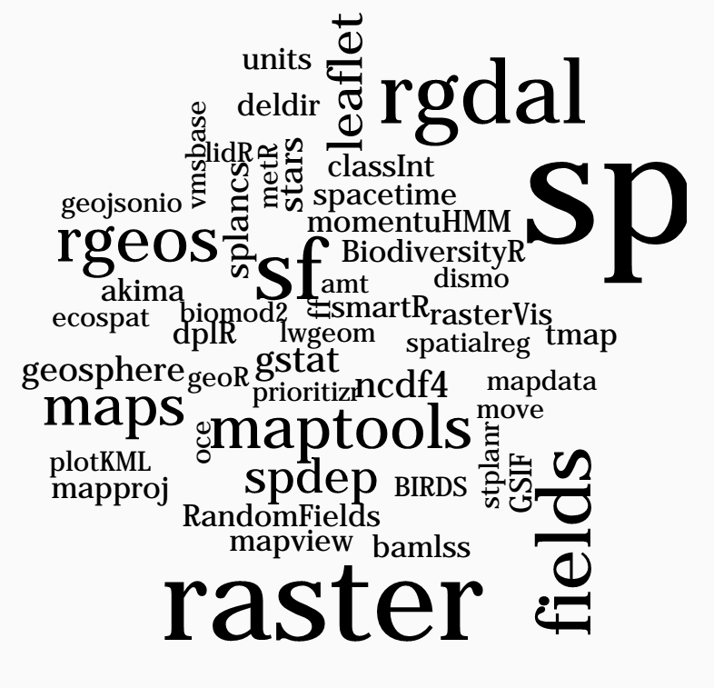
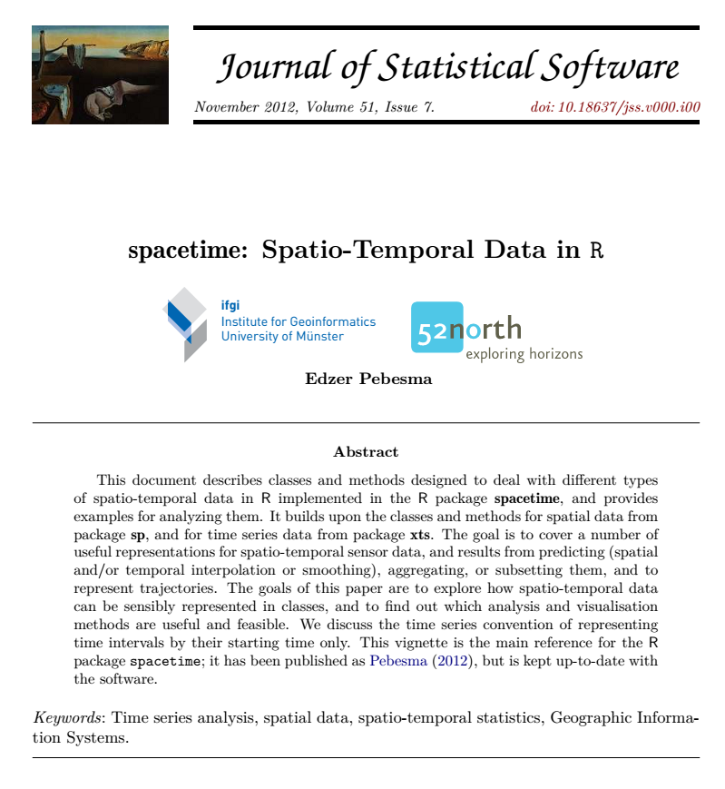
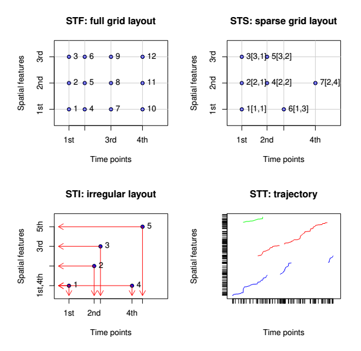
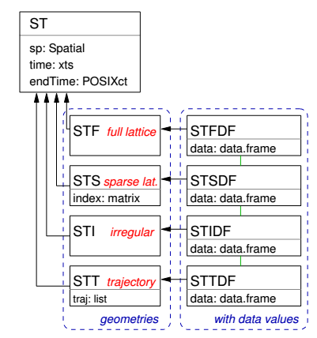
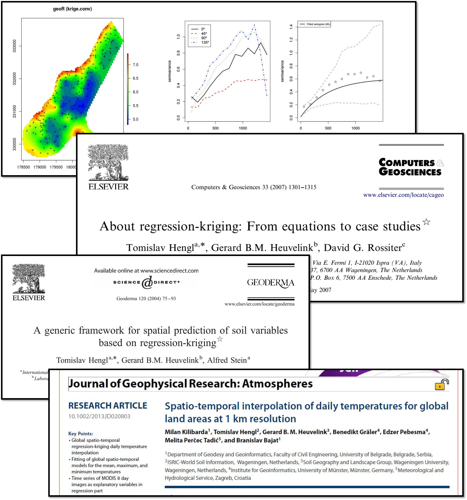
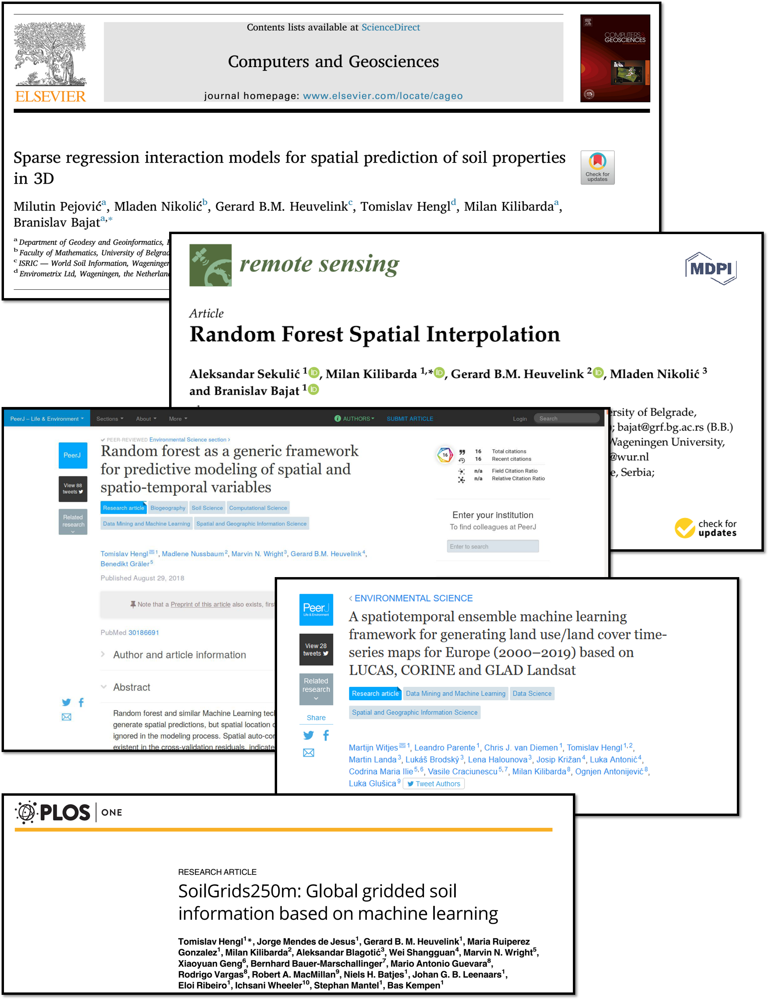
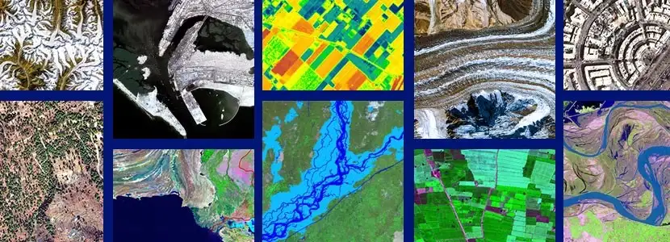
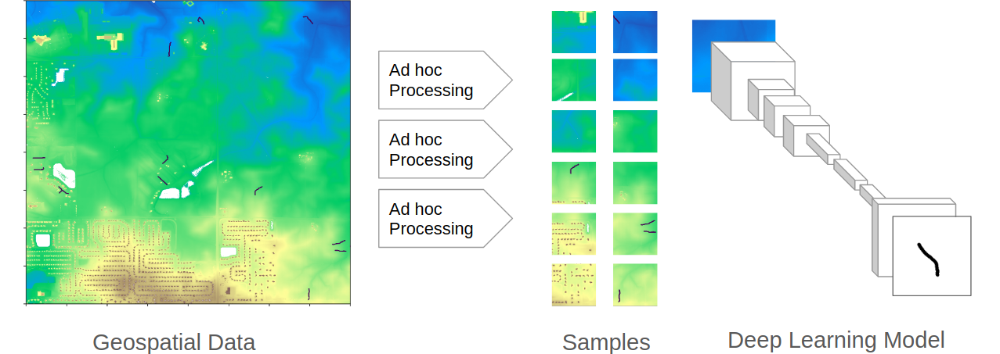
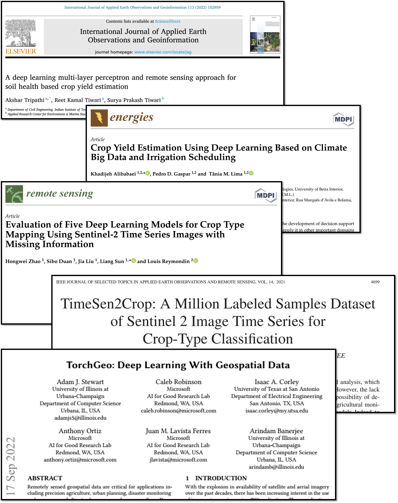

class: inverse, left, nonum, clear

background-image: url("figures/geo-banner.jpg")
background-size: cover

.titlestyle1[Analiza geo-prostornih podataka u R-u] 
<br><br><br>


<link rel="stylesheet" type="text/css" href="//fonts.googleapis.com/css?family=Lora" />

<br><br><br><br>

.titlestyle[Milutin Pejović & Petar Bursać]

.titlestyle[BelgradeR Meetup]

.titlestyle[2022-12-14, Startit, Beograd]

---
# O nama

.pull-left[

```{r, purl=FALSE,echo=FALSE, out.width="50%", fig.align='center'}

```

.center[**doc. dr Milutin Pejović, dipl.geod.inž.**]

]


.pull-right[

```{r, purl=FALSE,echo=FALSE, out.width="50%", fig.align='center'}
knitr::include_graphics("figures/PetarBursac.jpg")
```

.center[**Petar Bursac, mast.inž.geod.**]

]

----

.center[**Građevinski fakultet Univerziteta u Beogradu**]
.center[**Odsek za Geodeziju i Geoinformatiku**]


---
# O nama

- 2004 - Master akademske studije Geoinformatike.

- 2015 - Laboratorija za razvoj geoporostornih tehnologija otvorenog koda [OSGL](http://osgl.grf.bg.ac.rs/en/)

- Kursevi i konferencije:

  - 2008 - GEOSTAT Belgrade workshop  - lectures: Tomislav Hengl
  
  - 2011 - GEOSTAT 2011 workshop - lectures: Victor Olaya, Tomislav Hengl
  
  - 2014 - World Daily Meteo Conference - keynote speakers: Edzer Pebesma, Gerard Heuvelink, Tomislav Hengl
  
  - 2016 - GeoMLA (Geostatistics and Machine Learning) conference; keynote speakers: Mikhail Kanevski, Mirko Orlić, Wolfgang Wagner, Ole Einar Tveito, Tomislav Hengl. 

- 2022 - <font color='red'>Geoinformatika</font> - novi studijski program na Građevinskom fakultetu 


---
class: inverse, center, middle

# Geo-spatial data science

### *"Spatial data science treats <font color='red'>location, distance, and spatial interaction</font> as core aspects of the data and employs specialized methods and software to store, retrieve, explore, analyze, visualize and learn from such data. In this sense, spatial data science relates to data science as spatial statistics to statistics, spatial databases to databases, and geocomputation to computation."*

.right[Luc Anselin, 2019]
.right["Spatial Data Science" in The International Encyclopedia of Geography: People, the Earth, Environment, and Technology.]


---
class: inverse, center, middle,
# Šta su to geo-prostorni podaci?

---
# Šta su to geo-prostorni podaci?

.pull-left[

.tiny[

- **Kombinuju informaciju sa <font color='red'>geografskom lokacijom i vremenom </font> geografskom lokacijom i vremenom na koje se odnose**

- **Geo-prostorni vs. prostorni podaci**

- **Digitalno predstavljaju prirodne i antropogene objekte, prostorne pojave i dogadjaje stavljajući ih u kontekst geografskog prostora**

- **GPS je operativan od 2000 godine.**

- **In 2008, more than 150 Earth observation satellites were in orbit, recording data with both passive and active sensors and acquiring more than 10 terabits of data daily. (Fifty Years of Earth-observation Satellites by A. Tatem, S. Goetz, S. Hay)**

- **Danas je preko 80% digitalnih podataka referisano na geografsku lokaciju (bez reference)**
]

]

.pull-right[


```{r, echo=FALSE, out.width='100%', fig.align='center'}


```

```{r, echo=FALSE, out.width='80%', fig.align='center'}
knitr::include_graphics('figures/space_time_1.png')

```

]


---
# Izvori geo-prostornih podataka

.pull-left[

.tiny[

- Javni podaci državnih službi (prostorni inventari, premer, popis i mape)
- Podaci permanentnih mernih stanica i senzora (senzori)
- Podaci daljinske detekcije (GNSS, LiDAR i satelitski snimci)
- Personalni podaci i podaci sa društvenih mreža

- Javno dostupni globalni podaci:
  - http://freegisdata.rtwilson.com/
  - https://data.nasa.gov/
  - https://land.copernicus.eu/
  - https://maps.elie.ucl.ac.be/CCI/viewer/
  - https://www.ecad    .eu//dailydata/predefinedseries.php
  - http://www.worldclim.org/version2
  - https://www.geoportal.org/
  - ...


]

]

.pull-right[


```{r, echo=FALSE, out.width='60%', fig.align='center'}


```

```{r, echo=FALSE, out.width='80%', fig.align='center'}


```

]

---
# Primeri primene geo-prostornih podataka

.pull-left[

.tiny[

- **<font color='red'>Ekologija</font>**
- **<font color='red'>Daljinska detekcija (satelitski snimci)</font>**
- **Ekonomija**
- **Demografija**
- **Arheologija**
- **Transport**
- **<font color='red'>Klimatologija</font>**
- **Meteorologija** 
- **<font color='red'>Geo-morfometrija</font>**
- **Hidrologija**
- **<font color='red'>Poljoprivreda</font>**
- **Rudarstvo**
- **<font color='red'>Zemljište</font>**
- **Turizam**
- **i mnogi drugi...**

]

]

.pull-right[

```{r, out.width="95%", echo=FALSE}
knitr::include_graphics("figures/montbayabove.gif")
```
 
```{r, echo=FALSE, out.width="95%"}

```

]


---
class: inverse, center, middle,
# Geo-prostorni podaci u R-u


---
# Istorija


.large[
- **pre-2003. - razvoj drugih paketa namenjenih prostornoj analizi (<font color='red'>`MASS`</font>, <font color='red'>`spatstat`</font>, <font color='red'>`geoR`</font> itd.)**

- **2003. - Vienna workshop, početak rada na <font color='red'>`sp`</font> paketu i definisanju klasa i metoda namenjenih geo-prostornim podacima**

- **2003. - Publikovan paket <font color='red'>`rgdal`</font>**

- **2005. - Publikovan paket <font color='red'>`sp`</font>**

- **2005. - Applied Spatial Data Analysis with R, 1st ed.**

- **2010. - Publikovan paket <font color='red'>`raster`</font>**

- **2011. - Publikovan paket <font color='red'>`rgeos`</font>**

- **2013. - Applied Spatial Data Analysis with R, 2nd ed.**

- **2016. - Publikovan paket <font color='red'>`sf`</font>**

- **2019. - Publikovan paket <font color='red'>`stars`</font>**

- **2020. - Publikovan paket <font color='red'>`terra`</font>**
]


---
# Danas je dostupno preko 1000 paketa

.pull-left[
- [**sf**](https://github.com/r-spatial/sf),
[**sp**](https://github.com/edzer/sp),
[**terra**](https://github.com/rspatial/terra),
[**raster**](https://github.com/rspatial/raster), [**stars**](https://github.com/r-spatial/stars), [**gdalcubes**](https://github.com/appelmar/gdalcubes_R) - klase i metode za skladištenje geo-prostornih podataka
 
- [**rnaturalearth**](https://github.com/ropensci/rnaturalearth), [**osmdata**](https://github.com/ropensci/osmdata), [**getlandsat**](https://github.com/ropensci/getlandsat) - download geo-prostornih podataka

- [**rgrass7**](https://github.com/rsbivand/rgrass7), [**qgisprocess**](https://github.com/paleolimbot/qgisprocess), [**RSAGA**](https://github.com/r-spatial/RSAGA), [**link2GI**](https://github.com/r-spatial/link2GI) - veza sa GIS softverima

- [**gstat**](https://github.com/r-spatial/gstat), [**mlr3**](https://github.com/mlr-org/mlr3), [**CAST**](https://github.com/HannaMeyer/CAST), [**spatstat**](http://spatstat.org/), [**spdep**](https://github.com/r-spatial/spdep), [**spatialreg**](https://github.com/r-spatial/spatialreg) - modeliranje geo-prosotrnih podataka

- [**rasterVis**](https://github.com/oscarperpinan/rastervis), [**tmap**](https://github.com/mtennekes/tmap), [**ggplot2**](https://github.com/tidyverse/ggplot2), [**rayshader**](https://github.com/tylermorganwall/rayshader) - statična vizualizacija i kartiranje
- [**leaflet**](https://github.com/rstudio/leaflet), [**mapview**](https://github.com/r-spatial/mapview), [**mapdeck**](https://github.com/SymbolixAU/mapdeck) - interaktivna vizualizacija i kartiranje

- i mnogi drugi...

CRAN task view: https://cran.r-project.org/web/views/Spatial.html.
]

.pull-right[

</br>

```{r, echo=FALSE, out.width='80%', fig.align='center'}


```

]


---
# Osobine geo-prostornih podataka

.pull-left[


.tiny[

</br>
</br>

- **Koordinate i koordinatni sistem**

</br>
</br>
</br>
  
- **Geometrija**

</br>
</br>

- **Atributi i razmera**

]

]

.pull-right[


```{r, echo=FALSE, out.width='65%', fig.align='left'}
knitr::include_graphics('figures/CS-article-1.jpg')

```


```{r, echo=FALSE, out.width='80%', fig.align='left'}
knitr::include_graphics('figures/2019-points-lines-polygons.png')

```


```{r, echo=FALSE, out.width='80%', fig.align='left'}


```

]


---
# Osobine geo-prostornih podataka

.pull-left[


.tiny[

</br>
</br>

- **<font color='red'>Koordinate i koordinatni sistem</font>**

</br>
</br>
</br>
  
- **Geometrija**

</br>
</br>

- **Atributi i razmera**

]

]

.pull-right[


```{r, echo=FALSE, out.width='65%', fig.align='left'}
knitr::include_graphics('figures/CS-article-1.jpg')

```


```{r, echo=FALSE, out.width='80%', fig.align='left'}
knitr::include_graphics('figures/2019-points-lines-polygons.png')

```


```{r, echo=FALSE, out.width='80%', fig.align='left'}


```

]


---
# Koordinate i Koordinatni Referenti Sistem (CRS)


.center[
***<font color='red'>"Data are not just numbers, they are numbers with a context; “In data analysis, context provides meaning”</font>*** ([Cobb and Moore, 1997](http://www.jstor.org/stable/2975286))
]

--

.center[
***<font color='darkgreen'>"Coordinates are not just numbers, they are numbers with a spatial context”</font>***
]

----

--

**<font color='red'>Koordinatni Referentni Sistem (CRS)</font> definiše prostorni kontekst. On predstavlja set informacija kojim se opisuje geografski prostoru u matematičkom smislu (u odnosu na Zemlju) i sastoji se od:**

- set matematičkih pravila kojim se definiše kako se koordinate dodeljuju tačkama u prostoru (koordinatni sistem)
- set parametara koji definišu poziciju početka koordiatnog sistema, razmera i orijentacija koordinatnog sistema (datum)

----

--

.pull-left[
**Možemo razlikovati dve glavne grupe koordinatnih referentih sistema**: 
- <font color='red'>Geografski koordinatni sistemi</font> 
- <font color='red'>Koordinatni sistemi u projekciji</font>
]

.pull-right[
```{r, echo=FALSE, out.width='80%', fig.align='center'}
knitr::include_graphics('figures/CoordinateSystems.jpg')
```
]


---
# Opis koordinatnog sistema


```{r echo=FALSE, massage=FALSE}

suppressPackageStartupMessages(suppressWarnings(library(sf)))
suppressPackageStartupMessages(suppressWarnings(library(here)))
suppressPackageStartupMessages(suppressWarnings(library(tmap)))
suppressPackageStartupMessages(suppressWarnings(library(tidyverse)))

```


**Do sada najzastupljeniji, ali u svom zalasku:**

- `proj4string` - `r st_crs(4326)$proj4string`


.pull-left[
**Dva preporučena pristupa:**

- CRS codes, e.g., EPSG:4326
- `WKT2`

----

*Više informacija:*

.tiny[
- https://proj.org/usage/projections.html
- https://spatialreference.org/ref/epsg/
- https://www.youtube.com/watch?v=Va0STgco7-4 
- https://www.gaia-gis.it/fossil/libspatialite/wiki?name=PROJ.6

]

]

.pull-right[
.tiny[
```{r, purl=FALSE,echo=FALSE}
st_crs(4326)
```
]
]


---
class: inverse, center, middle,
# Vektorski model podataka


---
# Vektorski model podataka

.pull-left[

## <font color='red'>Vektorski podaci</font>

.tiny[

- **Tačke, linije, poligoni (kombinacije osnovnih geometrijskih entiteta)**

- **Predstavljaju diskretne objekte u prostoru**

  - **Uzorkovanja (merenja) na određenim lokacijama**
  
  - **Granice područja**
  
  - **Trase i trajektorije**
  
- **Poznati fajl formati: ESRI Shapefile (.shp, .shx, .dbf, .prj), GeoJSON, GPX (.gpx), geopackage (.gpk)**


]

]

.pull-right[


```{r, echo=FALSE, out.width='35%', fig.align='center'}


```
`

]

---
class: hide-logo
# <font color='red'>sf</font> paket (revolucija u radu sa geo-prostornim podacima)

```{r echo = FALSE, out.width = '20%', fig.align='center'}
knitr::include_graphics("figures/sf_logo.gif")
```

- **<font color='red'>sf</font> je naslednik (2016) <font color='red'>sp</font> paketa koji omogućava klase i metode za vektorske geo-prostorne podatke.**

-	**<font color='red'>sf</font> implmenetira OGC standard `ISO 19125-1:2004` <font color='red'>Simple Features</font>  za reprezentovanje geo-prostornih podataka**

- **<font color='red'>sf</font> omogućava funkcionalnosti dobro poznatih i proverenih biblioteka: `GDAL`, `PROJ` and `GEOS`.**

-	**<font color='red'>sf</font> classes are stored within `data.frame` like objects.**

- **Komplementaran je sa <font color='red'>tidyverse</font> familijom paketa!**

???
Simple feature is an international standard for representing and encoding spatial data, dominantly represented by point, line, and polygon geometries (ISO, 2004). The most important reason for using this approach is better manipulation of spatial data geometry, and simple way to store geometries in data corresponding record, or data.frame "row", which works very well with the tidyverse package family.


---
# sf ekosistem

.pull-left[

<a href="https://www.osgeo.org/">
```{r, echo=FALSE, out.width="40%"}
knitr::include_graphics("https://www.osgeo.org/wp-content/themes/roots/assets/img/logo-osgeo.svg")
```

**[PROJ](https://www.osgeo.org/projects/proj/)**
- "Konverzija koordinata"
- Prva verzija [1970s](https://en.wikipedia.org/wiki/PROJ#cite_note-Kresse_Danko_2011_p._948-3)

**[GDAL](https://www.osgeo.org/projects/gdal/)**
- Geospatial Data Abstraction Library, prva verzija 2000
- "200+ geo-prostornih fajl formata"

**[GEOS](https://www.osgeo.org/projects/gdal/)**
- Geometry Engine – Open Source


]

.pull-right[

```{r, echo=FALSE, out.width="100%", fig.align='center'}
knitr::include_graphics("figures/sf-infrastructure.png")
```

]

---
# sf geometrije

```{r, echo=FALSE, out.width="50%", fig.align='center'}
knitr::include_graphics("figures/fig-sfgeometries-1.png")
```

---
# sf klasa inside

```{r, echo=FALSE, out.width="80%", fig.align='center'}
knitr::include_graphics("figures/sf_classes.png")
```


---
class: inverse, center, middle,
# Rasterski model podataka

---
# Rasterski model podataka

.pull-left[

## <font color='red'>Rasterski podaci</font>

.tiny[

- **Rasterski podaci predstavljaju mozaik manjih poligona (ćelija), najčešće kvadratnih i jednakih dimenzija, u kojem svaka čelija predstavlja vrednost prostornog fenomena u odgovarajućoj prostornoj oblasti na koju se čelija odnosi, u određenom trenutku**

- **Prirodni format satelitskih i aero-snimaka zemlje iz vazduha**

- **Odgovarajuči za predstavljanje kontinualnih objekata u prostoru (temperatura, nadmosrska visina, itd)**

- **Poznati fajl formati: GeoTIFF, Erdas Imagine Image (.img), HDF (.hdf), NetCDF (.nc)**


]

]

.pull-right[


```{r, echo=FALSE, out.width='35%', fig.align='center'}
knitr::include_graphics('figures/raster_1.png')

```
`

]


---
# <font color='red'>terra</font> paket

- **terra** omogućava klase i metode za rasterske podatke (naslednik `raster` paketa)

- Omogućava kreiranje, učitavanje, manipulaciju i pisanje jedno-dimenzionalnih i više-dimenzionalnih (single and multiband) rasterskih podataka

- Omogućava rad sa rasterskim podacima koji su skladišteni na disku (suviše veliki za učitavanje u memoriju)

- Omogućava funkcionalnosti rasterske algebre: 
  1. **Lokalne operacije** - operacije nad ćelijama (pojedinačno)
  2. **Fokalne operacije** - rezultat **focal** operacija je najčešće rezultat analize bloka okolnih ćelija (najlešće 3x3) 
  3. **Zonalne operacije** - operacije služe za sumiranje rastera po određenim zonama, definisanim vektorskim prostornim objektom,
  4. **Globalne operacije** - služe za sumiranje vrednost jednog ili više rasterskih lejera.

- Dodatne funkcionalnosti (`crop`, `merge`, `aggregate`, `resample`) kao i dodatne funkcionalnosti za analizu DMT-a


???

A notable feature of the terra package is that it can work with raster datasets that are stored on disk and are too large to be loaded into memory (RAM). The package can work with large files because the objects it creates from these files only contain information about the structure of the data, such as the number of rows and columns, the spatial extent, and the filename, but it does not attempt to read all the cell values in memory. In computations with these objects, data is processed in chunks. If no output filename is specified to a function, and the output raster is too large to keep in memory, the results are written to a temporary file.

---
# <font color='red'>terra</font> klase podataka

</br>

- **`SpatRaster`** - multi-lejer objekat koji je namenjen radu sa velikim rasterskim podacima koji ne mogu biti skaldišteni u radnom memoriji računara.  On skladišti niz osnovnih parametara koji ga opisuju. To uključuje broj kolona i redova, koordinate njegovog prostornog obuhvata (eng. extent) i koordinatni referentni sistem (projekcija). 

- **SpatVector** - vektorski model podataka

- **SpatExtent** - klasa za predstavljanje prostornog obuhvata (spatial extent) 


---
class: inverse, center, middle,
# Data Cubes - Višedimenzionalne strukture geo-prostornih podataka


---
# Data Cubes

.pull-left[

.tiny[

- **Uključivanje vremenske komponente u prostorne podatke**

  - **tro-dimenzionalni podaci (vektor)**
  
  - **četvoro-dimenzionalni podaci (raster)**
  
  - **više-dimenzionlani podaci**

- **Odgovarajuči za predstavljanje podataka prostornog monitoringa**

]

]

.pull-right[


```{r, echo=FALSE, out.width='45%', fig.align='center'}
knitr::include_graphics('figures/space_time_1.png')

```


```{r, echo=FALSE, out.width='70%', fig.align='center'}
knitr::include_graphics('figures/fig-cube4d-1.png')

```


```{r, echo=FALSE, out.width='45%', fig.align='center'}


```

]


---
# <font color='red'>spacetime</font> paket

.pull-left[

- Publikovan 2010. godine

- Klase i metode za različite tipove prostorno-vremenskih vektorskih podataka

- Oslanja se na `sp` (prostor) i `xts` (vreme) klase.

]

.pull-right[

```{r, echo=FALSE, out.width='80%', fig.align='center'}


```

]

---
# <font color='red'>spacetime</font> paket

.pull-left[

**Slučajevi prostorno-vremenskih podataka**

```{r, echo=FALSE, out.width='80%', fig.align='center'}


```

]

**Klase prostorno-vremenskih podataka**

.pull-left[

```{r, echo=FALSE, out.width='80%', fig.align='center'}


```

]


---
# <font color='red'>stars</font> paket


.pull-left[

- **stars** obezbedjuje klase i metode za reprezentovanje prostorno-vremenskih (**rasterskih** i vektorskih) podataka

- Namenjen je radu sa vremenskim serijama prevashodno rasterskih podataka (satelitskim snimcima)

- Cilj razvijanja ovog paketa je da omogući:

  1. Rad sa rasterskim podacima koji je dobro integrisan sa `sf` i `tidyverse` paketima
  2. Rad sa rasterskim podacima kao više-dimenzionalnim nizovima (arrays)
  3. Rad sa velikim setovima podataka (out-of-memory) pomoću `raster_proxy` objekata
  4. Rad sa različitim vrstama rasterskih podataka (regular, rotated, sheared, rectilinear and curvilinear rasters)

- https://r-spatial.github.io/stars/
]

.pull-right[
```{r, echo=FALSE, out.width="80%", fig.align='center'}
knitr::include_graphics("figures/cube2.png")
```
]

---
# <font color='red'>gdalcubes</font> paket

## Harmonizacija vremenskih serija rasterskih podataka

**`gdalcubes`** je namenjen kreiranju harmonizovanih "data cubes" formi rasterskih podataka od različitih kolekcija (vremenskih serija) više-dimenzionalnih rasterskih podataka, u slučajevima kada:

- Prostorna rezolucija nije ista

- Prostorni obuhvat nije isti

- Koordinatni referentni sistemi nisu isti

- Vreme opažanja (uzorkovanja) nije isto


???
- Images from different areas of the world have different spatial reference systems (e.g., UTM zones).
- The pixel size of a single image sometimes differs among its spectral bands / variables.
- Spatially adjacent image tiles often overlap.
- Time series of images are often irregular when the area of interest covers spatial areas larger than the extent of a single image.
- Images from different data products or different satellites are distributed in diverse data formats and structures.


---
# <font color='red'>sftime</font> paket

- **`sftime` - predstavlja proširenje `sf` klasa za skladištenje i manipulaciju prostorno-vremenskim vektorskim podacima**

- **Prvi put publikovan u martu 2022. godine**

- **Kreiran je sa ciljem na nadomesti nedostatke `stars` paketa u pogledu geometrije i regularnosti vremenske serije podataka**


---
class: inverse, center, middle,
# Analiza geo-prostornih podataka u R-u


---
# Šta obuhvata i zašto R?

.pull-left[
1. **Učitavanje i ispisivanje geo-prostornih podataka** - **<font color='red'>gdal, osmdata, rnaturalearth, getlandsat </font>**

2. **Skladištenje (klase i metode) podataka** - **<font color='red'>sf (sp), terra (raster), stars, sftime</font>**

3. **Pregled i manipulacija podacima** - **<font color='red'>tidyverse</font>**

3. **Deskriptivna i ekspanatorna analiza podataka** - **<font color='red'>R</font>**

4. **Konverzija i transformacija koordinata** - **<font color='red'>proj</font>**

5. **GIS analiza i kartiranje** - **<font color='red'>ggplot, ggmap, maps, rasterVis tmap, mapview ...</font>**

6. **Statistična i geostatistička analiza** - **<font color='red'>gstat, spdep, spatstat ...</font>**

7. **Modeliranje i prostorna predikcija** - **<font color='red'>mlr (mlr3spatiotempcv, mlr3spatial), tidymodels, ...</font>**

8. **Komunikacija i publikacija** - **<font color='red'>shiny, rmarkdown (quarto)</font>**

]

--

.pull-right[

.center[

</br>
</br>

### **<font color='red'>Tajna je u jedinstvenoj i potpuno zaokruženoj kombinaciji fantastičnih mogućnosti R-a i specijalizovanih paketa za geoprostorne podatke</font>**

</br>
]


]


???

Analiza geoprostornih podataka se ne razlikuje puno od analize drugih podataka. Već prostorni podaci daju još jednu veliku mogućnost, a to je mogućnost vizualizacije.


---
# Analiza do-2015.

.pull-left[

- **Geostatistika**

  - **Kvantifikacija prostorne zavisnosti (Variogram, Moran I, spatial cluster analysis ...)**
  
  - **Kriging (simple and ordinary)**
  
  - **Uključivanje pomoćnjih promenljvih - Regression Kriging**
  
  - **Prostorno-vremenska geostatistika (gstat-krigeST) - modeliranje prostorno vremenske zavisnosti**
  
  - **2D/2D+T predikcija**
]

.pull-right[


```{r, echo=FALSE, out.width='100%', fig.align='center'}


```

]

---
# Analiza 2015-2020

.pull-left[

- **Ogromna količina prostornih podataka postaje sve dostupnija!**

----

- **Machine Learning with Spatial Data**

  - **Penalized linear models**
  
  - **Tree based models (Random Forest)**
  
  - **Ensemble ML models**

]

.pull-right[


```{r, echo=FALSE, out.width='85%', fig.align='center'}


```


]

---
# Analiza od-2020

.pull-left[

.center[

### Deep Learning and Remote Sensing

```{r, echo=FALSE, out.width='100%', fig.align='center'}


```

```{r, echo=FALSE, out.width='100%', fig.align='center'}


```

]

]

.pull-right[


```{r, echo=FALSE, out.width='80%', fig.align='center'}


```

]

---
class: inverse, center, middle,
# Hvala na pažnji!


