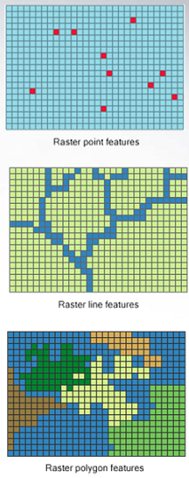

class: inverse, left, nonum, clear

background-image: url("figures/ArcGISBook_Header.jpg")
background-size: cover

.titlestyle1[Analiza geo-prostornih podataka u R-u] 
<br><br><br>


<link rel="stylesheet" type="text/css" href="//fonts.googleapis.com/css?family=Lora" />

<br><br><br><br>

.titlestyle[Milutin Pejović & Petar Bursać]

.titlestyle[2022-12-14, Startit, Beograd]

---
# O nama

.pull-left[

```{r, purl=FALSE,echo=FALSE, out.width="50%", fig.align='center'}
knitr::include_graphics("figures/MilutinPejovic_crop.jpg")
```

.center[**doc. dr Milutin Pejović, dipl.geod.inž.**]

]


.pull-right[

```{r, purl=FALSE,echo=FALSE, out.width="50%", fig.align='center'}

```

.center[**Petar Bursac, dipl.geod.inž.**]

]

----

.center[**Građevinski fakultet Univerziteta u Beogradu**]
.center[**Odsek za Geodeziju i Geoinformatiku**]


---
# O nama

- 2004 - Master akademske studije Geoinformatike.

- 2008 - Laboratorija za razvoj geoporostornih tehnologija otvorenog koda [OSGL](http://osgl.grf.bg.ac.rs/en/)

- Kursevi i konferencije:

  - 2007 - GEOSTAT Belgrade workshop  - lectures: Tomislav Hengl
  
  - 2011 - GEOSTAT 2011 workshop - lectures: Victor Olaya, Tomislav Hengl
  
  - 2014 - World Daily Meteo Conference - keynote speakers: Edzer Pebesma, Gerard Heuvelink, Tomislav Hengl
  
  - 2016 - GeoMLA (Geostatistics and Machine Learning) conference; keynote speakers: Mikhail Kanevski, Mirko Orlić, Wolfgang Wagner, Ole Einar Tveito, Tomislav Hengl. 

- 2022 - <font color='red'>Geoinformatika</font> - novi studijski program na Građevinskom fakultetu 

---
class: inverse, center, middle,
# Šta su to geo-prostorni podaci?

---
# Šta su to geo-prostorni podaci?

.pull-left[

.tiny[

- **Kombinuju informaciju sa <font color='red'>geografskom lokacijom i vremenom </font> geografskom lokacijom i vremenom na koje se odnose**

- **Geo-prostorni vs. prostorni podaci**

- **Digitalno predstavljaju prirodne i antropogene objekte, prostorne pojave i dogadjaje stavljajući ih u kontekst geografskog prostora**
]

]

.pull-right[


```{r, echo=FALSE, out.width='100%', fig.align='center'}
knitr::include_graphics('figures/Geographic_information.png')

```

```{r, echo=FALSE, out.width='80%', fig.align='center'}
knitr::include_graphics('figures/space_time_1.png')

```

]


---
# Izvori geo-prostornih podataka

.pull-left[

.tiny[

- **Javni podaci državnih službi (prostorni inventari, premer, popis i mape)**

- **Podaci permanentnih stanica i senzora (senzori)**

- **Podaci daljinske detekcije (navigacija i satelitski snimci)**

- **Personalni podaci i podaci sa društvenih mreža**
]

]

.pull-right[


```{r, echo=FALSE, out.width='60%', fig.align='center'}
knitr::include_graphics('figures/data_layers_2.jpg')

```

```{r, echo=FALSE, out.width='80%', fig.align='center'}
knitr::include_graphics('figures/lidar-vs-photogrammetry-drone.jpg')

```

]

---
# Primeri primene geo-prostornih podataka

.pull-left[

.tiny[

- **Ekologija**
- **Daljinska detekcija (satelitski snimci)**
- **Ekonomija**
- **Demografija**
- **Arheologija**
- **Transport**
- **Klimatologija**
- **Meteorologija** 
- **Geo-morfometrija**
- **Hidrologija**
- **Urbano planiranje**
- **Rudarstvo**
- **Zemljište**
- **Turizam**
- **i mnogi drugi...**

]

]

.pull-right[

```{r, out.width="95%", echo=FALSE}
knitr::include_graphics("figures/montbayabove.gif")
```
 
```{r, echo=FALSE, out.width="95%"}
knitr::include_graphics("figures/water-detection.png")
```

]


---
# Tipovi geo-prostornih podataka

.pull-left[

## <font color='red'>Vektorski podaci</font>

.tiny[

- **Tačke, linije, poligoni (kombinacije osnovnih geometrijskih entiteta)**

- **Predstavljaju diskretne objekte u prostoru**

  - **Uzorkovanja (merenja) na određenim lokacijama**
  
  - **Granice područja**
  
  - **Trase i trajektorije**
  
- **Poznati fajl formati: ESRI Shapefile (.shp, .shx, .dbf, .prj), GeoJSON, GPX (.gpx), geopackage (.gpk)**


]

]

.pull-right[


```{r, echo=FALSE, out.width='35%', fig.align='center'}
knitr::include_graphics('figures/vector_1.png')

```
`

]


---
# Tipovi geo-prostornih podataka

.pull-left[

## <font color='red'>Rasterski podaci</font>

.tiny[

- **Rasterski podaci predstavljaju mozaik manjih poligona (ćelija), najčešće kvadratnih i jednakih dimenzija, u kojem svaka čelija predstavlja vrednost prostornog fenomena u odgovarajućoj prostornoj oblasti na koju se čelija odnosi, u određenom trenutku**

- **Prirodni format satelitskih i aero-snimaka zemlje iz vazduha**

- **Odgovarajuči za predstavljanje kontinualnih objekata u prostoru (temperatura, nadmosrska visina, itd)**

- **Poznati fajl formati: GeoTIFF, Erdas Imagine Image (.img), HDF (.hdf), NetCDF (.nc)**


]

]

.pull-right[


```{r, echo=FALSE, out.width='35%', fig.align='center'}


```
`

]


---
# Višedimenzionalne strukture geo-prostornih podataka

.pull-left[

## <font color='red'>Data cubes</font>

.tiny[

- **Uključivanje vremenske komponente u prostorne podatke**

  - **tro-dimenzionalni podaci (vektor)**
  
  - **četvoro-dimenzionalni podaci (raster)**
  
  - **više-dimenzionlani podaci**

- **Odgovarajuči za predstavljanje podataka prostornog monitoringa**

]

]

.pull-right[


```{r, echo=FALSE, out.width='45%', fig.align='center'}
knitr::include_graphics('figures/space_time_1.png')

```


```{r, echo=FALSE, out.width='70%', fig.align='center'}


```


```{r, echo=FALSE, out.width='45%', fig.align='center'}
knitr::include_graphics('figures/space_time_raster.png')

```

]

---
# Osobine geo-prostornih podataka

.pull-left[


.tiny[

</br>
</br>

- **Koordinate i koordinatni sistem**

</br>
</br>
</br>
  
- **Geometrija**

</br>
</br>

- **Atributi i razmera**

]

]

.pull-right[


```{r, echo=FALSE, out.width='65%', fig.align='left'}


```


```{r, echo=FALSE, out.width='80%', fig.align='left'}
knitr::include_graphics('figures/2019-points-lines-polygons.png')

```


```{r, echo=FALSE, out.width='80%', fig.align='left'}
knitr::include_graphics('figures/Point_Attribute_Table.png')

```

]

---
# Koordinate i Koordinatni Referenti Sistem (CRS)

</br>
</br>

.center[
***<font color='red'>"Data are not just numbers, they are numbers with a context; “In data analysis, context provides meaning”</font>*** ([Cobb and Moore, 1997](http://www.jstor.org/stable/2975286))
]

</br>

.center[
***<font color='red'>"Coordinates are not just numbers, they are numbers with a spatial context”</font>***
]

---
# Koordinatni referenti sistem - terminologija


- **Koordinatni sistem (coordinate system) je set matematickih pravila koja definišu kako se koordinate dodeljuju tački**

- **Datum (datum) je set parametara koji definiše položaj koordinatnog početka, razmeru i orijentaciju koordinatnog sistema**

- **Geodetski datum opisuje odnos koordinatnog sistema u odnosu na Zemlju**

- **Koordinatni Referentni Sistem (Coordinate Reference System) je koordinatni sistem ciji je položaj odreden datumom u odnosu na referentni objekat. U slucaju planete zemlje (WGS84) parametri geodetskog datuma se koriste.**

- **Možemo razlikovati Geografske koordinatne sisteme, Koordinatni sistemi u projekciji i Lokalne koordinatne sisteme.**


---
# Geografski (geodetski) koordinatni sistem


.pull-left[

- **Podrzumevaju definisane: elipsoid, početni meridian (podrazumevan), datum**

</br>


- **Određuju poziciju u okviru elipsoidnog koordinatnog referentnog sistema**

  - **Geografska širina i dužina (Latitude, longitude) i elispoidna visina**
  
  - **Geocentrični metrički sistem (X, Y, Z)**
  
]


.pull-right[

```{r echo=FALSE, massage=FALSE}

suppressPackageStartupMessages(suppressWarnings(library(sf)))
suppressPackageStartupMessages(suppressWarnings(library(here)))
suppressPackageStartupMessages(suppressWarnings(library(tmap)))
suppressPackageStartupMessages(suppressWarnings(library(tidyverse)))

GK <- "+proj=tmerc +lat_0=0 +lon_0=21 +k=0.9999 +x_0=7500000 +y_0=0 +ellps=bessel +towgs84=574.027,170.175,401.545,4.88786,-0.66524,-13.24673,0.99999311 +units=m"

srbija <- suppressMessages(st_read(here::here("data", "Srbija", "RAP.shp"), quiet = TRUE))

srbija_wgs <- st_transform(srbija, 4326)

srbija_gk <- st_transform(srbija, GK)

ggplot(srbija) + geom_sf() + theme_bw()

```

]
---
# Koordinatni sistemi u projekciji

.pull-left[

- **Podrzumevaju definisane: elipsoid, početni meridian (podrazumevan), datum i parametre projekcije**

</br>

- **Pozicija se određuje pravouglim koordinatama (Easting, Northing)**

]

.pull-right[

```{r echo=FALSE}

ggplot(srbija_gk) + geom_sf() + coord_sf(datum = st_crs(GK)) + theme_bw()

```

]

---
# Šta obuhvata analiza geo-prostornih podataka?

1. **Učitavanje i ispisivanje prostornih podataka**
2. **Skladištenje i manipulacija podacima (organizaciju podataka u odgovarajuću formu)**
3. **Deskriptivna i ekspanatorna analiza podataka**
4. **GIS analiza i kartiranje**
5. **Prostorna statistična analiza (da li neka pojava može biti predstavljena statističkim modelom**
6. **Modeliranje i prostorna predikcija**
7. **Komunikacija**


---
# OSGeo biblioteke

.left-column[
**[PROJ](https://www.osgeo.org/projects/proj/)**

- "Konverzija koordinata"
- Prva verzija [1970s](https://en.wikipedia.org/wiki/PROJ#cite_note-Kresse_Danko_2011_p._948-3)

**[GDAL](https://www.osgeo.org/projects/gdal/)**

- Geospatial Data Abstraction Library, prva verzija 2000
- "200+ geo-prostornih fajl formata"

**[GEOS](https://www.osgeo.org/projects/gdal/)**

- Geometry Engine – Open Source

]
.right-column[
<a href="https://www.osgeo.org/">
```{r, echo=FALSE, out.width="80%"}
knitr::include_graphics("https://www.osgeo.org/wp-content/themes/roots/assets/img/logo-osgeo.svg")
```
</a>

```{r, echo=FALSE, out.width="90%", fig.cap="GEOS build matrix"}

```

.caption[Source: https://trac.osgeo.org/geos]

- Access to these three libraries used to require **sp**, **rgdal** and **rgeos**
- Now **sf** provides a unified access to all three 🎉

]


```{r setup2, include=FALSE, purl=FALSE}
options(htmltools.dir.version = FALSE)
knitr::opts_chunk$set(fig.align = "center", cache = FALSE, fig.height = 5, echo = TRUE)
knitr::opts_chunk$set(root.dir = normalizePath("."))
```

```{r, purl=FALSE,echo=FALSE, message=FALSE}
library(sf)
## sfc objects creation ---------
point_sfc = st_sfc(st_point(c(1, 1)), crs = 4326)
linestring_sfc = st_sfc(st_linestring(rbind(c(0.8, 1), c(0.8, 1.2), c(1, 1.2))), crs = 4326)
polygon_sfc = st_sfc(st_polygon(list(rbind(
  c(1.2, 0.6), c(1.4, 0.6), c(1.4, 0.8), c(1.2, 0.8), c(1.2, 0.6)
))), crs = 4326)
multipoint_sfc = st_sfc(st_multipoint(rbind(c(1, 0.6), c(1.4, 1.1))), crs = 4326)
multipoint_sfc2 = multipoint_sfc - 0.5
multilinestring_sfc = st_sfc(st_multilinestring(list(rbind(
  c(1.2, 1), c(1.2, 1.4)
),
rbind(
  c(1.4, 0.4), c(1.6, 0.6), c(1.6, 0.8)
))), crs = 4326)
multipolygon_sfc = st_sfc(st_multipolygon(list(list(rbind(
  c(1.4, 1.2), c(1.6, 1.4), c(1.4, 1.4), c(1.4, 1.2)
)),
st_polygon(
  list(rbind(
    c(0.6, 0.6), c(0.9, 0.6), c(0.9, 0.9), c(0.6, 0.9), c(0.6, 0.6)
  ),
  rbind(
    c(0.7, 0.7), c(0.8, 0.8), c(0.8, 0.7), c(0.7, 0.7)
  ))
))),
crs = 4326)
## sf objects creation ---------
point_sf = st_sf(geometry = point_sfc)
linestring_sf = st_sf(geometry = linestring_sfc)
polygon_sf = st_sf(geometry = polygon_sfc)
multipoint_sf = st_sf(geometry = c(multipoint_sfc, multipoint_sfc2))
multilinestring_sf = st_sf(geometry = multilinestring_sfc)
multipolygon_sf = st_sf(geometry = multipolygon_sfc)
geometrycollection_sf = st_cast(
  c(
    point_sfc,
    linestring_sfc,
    polygon_sfc,
    multipoint_sfc,
    multilinestring_sfc,
    multipolygon_sfc
  ),
  "GEOMETRYCOLLECTION"
)
```


---
# Koordinate

```{r, warning=FALSE, purl=FALSE,echo=FALSE}
library(tmap)
library(sf)
polygon_sf$id = as.factor(c(1))
polygon_sf_af = polygon_sf
polygon_sf_af$geometry = polygon_sf_af$geometry + c(20, 40)
polygon_sf_afp = st_cast(polygon_sf_af, "MULTIPOINT")
tm_shape(polygon_sf_af) +
  tm_graticules() + 
  tm_polygons(col = "id", lwd = 7) +
  tm_shape(polygon_sf_afp) +
  tm_dots(size = 1) +
  tm_layout(main.title = "Geographic coordinates", legend.show = FALSE, inner.margins = 0.15) +
  tm_xlab("Longitude", space = 0.5) + 
  tm_ylab("Latitude", space = 0.5)


```


---
class: inverse, center, middle,
# Zašto je R fantastično okruženje za rad sa prostornim podacima?

---
# Zašto R za analizu geo-prostornih podataka?

- Moguća je kompletna analiza
- Lako podeliti kartu sa drugima (email, html...)

---
class: inverse, center, middle, 

# <font color='red'>terra paket</font>


---
# Klase rasterskih podataka u <font color='red'>terra</font> paketu

**`terra`** paket omogućava metode za manipulaciju i rad sa prostornim podacima u rasterskom i vektorskom formatu. Osnovne klase u `terra` paketu su sledeće

* **`SpatRaster`**

* **`SpatVector`**

* **`SpatExtent`**

---
# <font color='red'>SpatRaster</font>

</br>

**`SpatRaster`** je multi-lejer objekat koji je namenjen radu sa velikim rasterskim podacima koji ne mogu biti skaldišteni u radnom memoriji računara.  On skladišti niz osnovnih parametara koji ga opisuju. To uključuje broj kolona i redova, koordinate njegovog prostornog obuhvata (eng. extent) i koordinatni referentni sistem (projekcija). Pored toga, SpatRaster može da skladišti informacije o fajlovima u kojima se čuvaju vrednosti rasterskih ćelija. 


